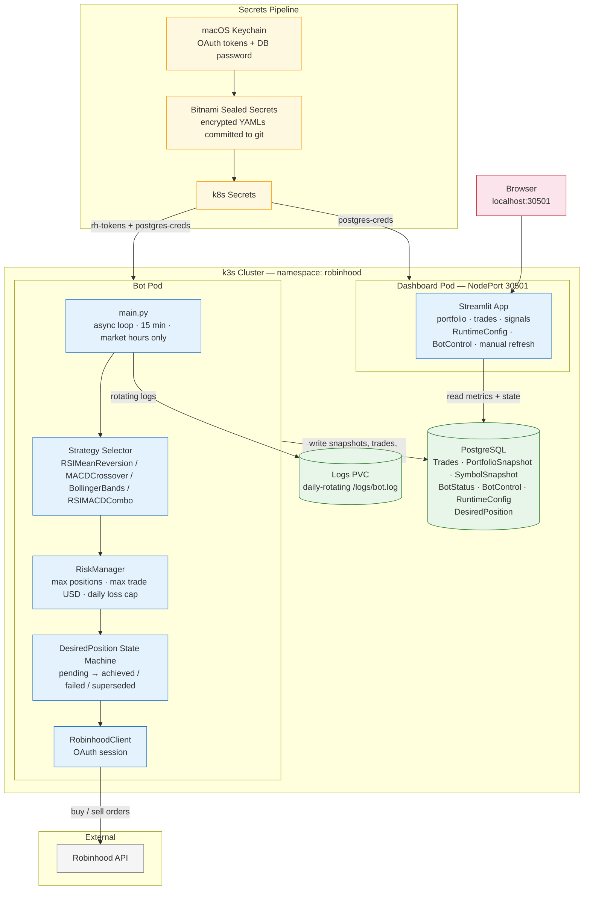

# robinhood-pilot — Architecture

**Legend**
- Light grey — external services
- Yellow — secrets pipeline (Keychain → Sealed Secrets → k8s)
- Blue — application pods / components
- Green — persistent storage
- Pink — end-user entry points
